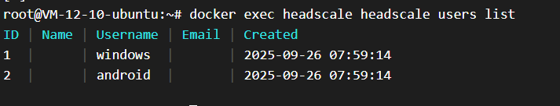
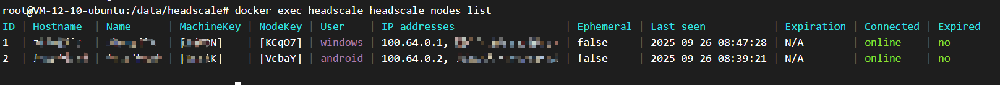

> 本次安装 headscale 的环境为 Linux 环境，使用 docker 部署服务。
>
> 宿主机目录 `/data/headscale/`为软件工作目录。

## 准备 config.yaml 文件

在工作目录创建 `config`目录，执行下述命令下载配置文件：

```bash
curl -k -o config.yaml https://raw.githubusercontent.com/juanfont/headscale/refs/heads/main/config-example.yaml
```

配置文件按表格中的配置和进行修改。

| 配置项                | 值                               | 说明                                              |
| --------------------- | -------------------------------- | ------------------------------------------------- |
| `listen_addr`         | 0.0.0.0:8080                     | Headscale 的监听地址和端口                        |
| `db_path`             | /var/lib/headscale/db.sqlite     | 存储 Headscale 数据的目录                         |
| `metrics_listen_addr` | 0.0.0.0:9090                     | 控制服务器 API 和 Web UI 的监听地址和端口         |
| `server_url`          | https://public_ip_or_domain:8080 | 唯一的外部可访问地址，宿主机 IP/域名，也可为 http |

> 只进行 P2P，不使用官方 derp 服务器或自建服务器中转。

## 准备 docker-compose 文件

```yaml
version: "3.8"

services:
  headscale:
    image: headscale/headscale:sha-474ea236
    container_name: headscale
    restart: unless-stopped
    command: serve
    ports:
      - "8080:8080"
      # - "9090:9090" # 按需开启
      - "3478:3478/udp"
    volumes:
      - /data/headscale/config/config.yaml:/etc/headscale/config.yaml:ro
      - /data/headscale/config/acl.hujson:/etc/headscale/acl.hujson:ro
      - /data/headscale/data:/var/lib/headscale
      - /data/headscale/run:/var/run/headscale
      - /etc/localtime:/etc/locatime:ro
```

headscale 的 docker 镜像版本可使用 `docker search headscale`进行查询。因为我的服务器问题，无法直接访问 docker.io，所以手动去 docker-hub 查询 headscale 最新镜像版本，地址 [headscale/headscale - Docker Image | Docker Hub](https://hub.docker.com/r/headscale/headscale) 。在官网可查询获得最 新版本镜像命令为 `docker pull headscale/headscale:sha-474ea236`，版本号是 `sha-474ea236`。

执行 `docker-compose up -d`命令即可启动容器。

## 进行连接测试

请进行相对应的 [tailscale 客户端](https://tailscale.com/download) 下载。这里以 windows 和 Android 为例进行连接测试。

#### 服务器操作

创建 2 个用户，分别为 android 和 windows。

```bash
docker exec headscale headscale users create android && docker exec headscale headscale users create windows
```

查看用户列表，可以看到是有两个用户。

```bash
docker exec headscale headscale users list
```



#### windows 操作

启动 tailscale 后使用管理员运行 PowerShell ，在其中执行下面的注册命令。

```bash
tailscale login --login-server https://public_ip_or_domain:8080
```

PowerShell 会输出一个网址，复制到浏览器中访问，会得到一个命令 `headscale nodes register --user USERNAME --key xxxxxx` ，将 USERNAME 替换为 windows，再去到服务器执行 `docker exec headscale headscale nodes register --user windows --key xxxxxx`。会提示 `Node xxx registered`，windows 完成注册。

#### Android 操作

在 GooglePlay/上述官网 中下载 tailscale 软件，进入 settings → Accounts → 右上角··· → Use an alternate server，输入 `https://public_ip_or_domain:8080` ，同样会得到一个注册命令，将 USERNAME 替换为 android，再去到服务器执行 `docker exec headscale headscale nodes register --user android --key xxxxxx`。会提示 `Node xxx registered`，android 完成注册。

#### 访问

执行 `docker exec headscale headscale nodes list` 可以看到 android 和 windows 都为在线状态。



## 常用操作命令
